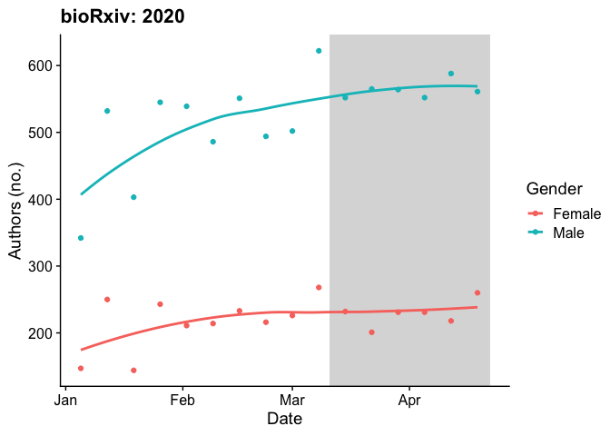
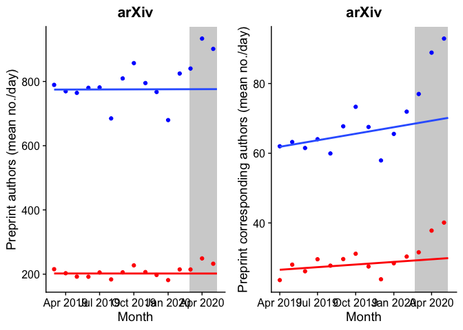

The COVID-19 pandemic’s gendered impact on academic productivity
================
Megan Frederickson
18/04/2020

# How is COVID-19 affecting the productivity of male versus female academics?

There is debate on Twitter about how the COVID-19 pandemic is affecting
submissions to journals, and expecially whether there are differences
between male and female scholars.

Anecdotally, journal editors have observed that submissions from female
scholars are down in March and April, 2020, presumably because women are
disproportionately shouldering increased caregiving burdens during the
pandemic, especially in the face of school and childcare closures. Is
this borne out by the data?

I do not have access to journal submission data directly, so I used data
from large preprint servers, where academics often archive their papers
as they submit them for peer-review to journals.

## arXiv submissions

First, I scraped submission data from arXiv (<https://arxiv.org/>),
which is the main preprint server for physics, math, computer science,
statistics, and other quantitative disciplines. I began by scraping all
records for March 15-April 15, 2020, during the COVID-19 pandemic, and
for the same date range in 2019. I then expanded to the same dates in
2018 and 2017. Finally, I scraped all the data for Jan. 1-March 15,
2020, immediately before the pandemic, and updated the pandemic data
with the most recent dates (April 16-22, 2020). I scraped the data in
batches, as recommended in the aRxiv package tutorial.

``` r
#Not run
#Get all submissions between March 15, 2020 and April 15, 2020 (during the COVID-19 pandemic)
n.2020 <- arxiv_count(query = 'submittedDate:[20200315 TO 20200415]')
n.2020.1 <- arxiv_count(query = 'submittedDate:[20200315 TO 20200321]')
df.2020.1 <- arxiv_search(query = 'submittedDate:[20200315 TO 20200321]', limit=n.2020, batchsize=1000)
n.2020.1-length(df.2020.1$id) 
n.2020.2 <- arxiv_count(query = 'submittedDate:[20200322 TO 20200328]')
df.2020.2 <- arxiv_search(query = 'submittedDate:[20200322 TO 20200328]', limit=n.2020, batchsize=1000)
n.2020.2-length(df.2020.2$id) 
n.2020.3 <- arxiv_count(query = 'submittedDate:[20200329 TO 20200403]')
df.2020.3 <- arxiv_search(query = 'submittedDate:[20200329 TO 20200403]', limit=n.2020, batchsize=1000)
n.2020.3-length(df.2020.3$id) 
n.2020.4 <- arxiv_count(query = 'submittedDate:[20200404 TO 20200409]')
df.2020.4 <- arxiv_search(query = 'submittedDate:[20200404 TO 20200409]', limit=n.2020, batchsize=1000)
n.2020.4-length(df.2020.4$id) 
n.2020.5 <- arxiv_count(query = 'submittedDate:[20200410 TO 20200412]')
df.2020.5 <- arxiv_search(query = 'submittedDate:[20200410 TO 20200412]', limit=2000, batchsize=500)
n.2020.5-length(df.2020.5$id) 
n.2020.6 <- arxiv_count(query = 'submittedDate:[20200413 TO 20200415]')
df.2020.6 <- arxiv_search(query = 'submittedDate:[20200413 TO 20200415]', limit=2000, batchsize=500)
n.2020.6-length(df.2020.6$id) 
df.2020.full <- rbind(df.2020.1, df.2020.2, df.2020.3, df.2020.4, df.2020.5, df.2020.6)
n.2020-length(df.2020.full$id)
write.csv(df.2020.full, file="arxiv_2020_data.csv")

#Get all submission between March 15, 2019 and April 15, 2019 (the same dates last year)
n.2019 <- arxiv_count(query = 'submittedDate:[20190315 TO 20190415]')
n.2019.1 <- arxiv_count(query = 'submittedDate:[20190315 TO 20190322]')
df.2019.1 <- arxiv_search(query = 'submittedDate:[20190315 TO 20190322]', limit=n.2019, batchsize=2000)
n.2019.1-length(df.2019.1$id)
n.2019.2 <- arxiv_count(query = 'submittedDate:[20190323 TO 20190329]')
df.2019.2 <- arxiv_search(query = 'submittedDate:[20190323 TO 20190329]', limit=n.2019, batchsize=2000)
n.2019.2-length(df.2019.2$id)
n.2019.3 <- arxiv_count(query = 'submittedDate:[20190330 TO 20190405]')
df.2019.3 <- arxiv_search(query = 'submittedDate:[20190330 TO 20190405]', limit=n.2019, batchsize=2000)
n.2019.3-length(df.2019.3$id)
n.2019.4 <- arxiv_count(query = 'submittedDate:[20190406 TO 20190412]')
df.2019.4 <- arxiv_search(query = 'submittedDate:[20190406 TO 20190412]', limit=n.2019, batchsize=2000)
n.2019.4-length(df.2019.4$id)
n.2019.5 <- arxiv_count(query = 'submittedDate:[20190413 TO 20190415]')
df.2019.5 <- arxiv_search(query = 'submittedDate:[20190413 TO 20190415]', limit=n.2019, batchsize=2000)
n.2019.5-length(df.2019.5$id)
df.2019.full <- rbind(df.2019.1, df.2019.2, df.2019.3, df.2019.4, df.2019.5)
n.2019-length(df.2019.full$id)
write.csv(df.2019.full, file="arxiv_2019_data.csv")

#Get all submissions between March 15, 2018 and April 15, 2018 (same dates two years ago)
n.2018 <- arxiv_count(query = 'submittedDate:[20180315 TO 20180415]')
n.2018.1 <- arxiv_count(query = 'submittedDate:[20180315 TO 20180321]')
df.2018.1 <- arxiv_search(query = 'submittedDate:[20180315 TO 20180321]', limit=n.2018, batchsize=2000)
n.2018.1-length(df.2018.1$id)
n.2018.2 <- arxiv_count(query = 'submittedDate:[20180322 TO 20180403]')
df.2018.2 <- arxiv_search(query = 'submittedDate:[20180322 TO 20180403]', limit=n.2018, batchsize=2000)
n.2018.2-length(df.2018.2$id)
n.2018.3 <- arxiv_count(query = 'submittedDate:[20180404 TO 20180409]')
df.2018.3 <- arxiv_search(query = 'submittedDate:[20180404 TO 20180409]', limit=n.2018, batchsize=2000)
n.2018.3-length(df.2018.3$id)
n.2018.4 <- arxiv_count(query = 'submittedDate:[20180410 TO 20180415]')
df.2018.4 <- arxiv_search(query = 'submittedDate:[20180410 TO 20180415]', limit=2000, batchsize=2000)
n.2018.4-length(df.2018.4$id)
df.2018.full <- rbind(df.2018.1, df.2018.2, df.2018.3, df.2018.4)
n.2018-length(df.2018.full$id)
write.csv(df.2018.full, file="arxiv_2018_data.csv")

#Get all submissions between Jan. 1, 2020 and March 15, 2020 (before COVID-19 pandemic)
n.early2020 <- arxiv_count(query = 'submittedDate:[20200101 TO 20200315]')
n.early2020.1 <- arxiv_count(query = 'submittedDate:[20200101 TO 20200115]')
df.early2020.1 <- arxiv_search(query = 'submittedDate:[20200101 TO 20200115]', limit=n.early2020, batchsize=2000)
n.early2020.1 - length(df.early2020.1$id)
n.early2020.2 <- arxiv_count(query = 'submittedDate:[20200116 TO 20200131]')
df.early2020.2 <- arxiv_search(query = 'submittedDate:[20200116 TO 20200131]', limit=n.early2020, batchsize=2000)
n.early2020.2 - length(df.early2020.2$id)
n.early2020.3 <- arxiv_count(query = 'submittedDate:[20200201 TO 20200215]')
df.early2020.3 <- arxiv_search(query = 'submittedDate:[20200201 TO 20200215]', limit=n.early2020, batchsize=2000)
n.early2020.3 - length(df.early2020.3$id)
n.early2020.4 <- arxiv_count(query = 'submittedDate:[20200216 TO 20200229]')
df.early2020.4 <- arxiv_search(query = 'submittedDate:[20200216 TO 20200229]', limit=n.early2020, batchsize=2000)
n.early2020.4 - length(df.early2020.4$id)
n.early2020.5 <- arxiv_count(query = 'submittedDate:[20200301 TO 20200315]')
df.early2020.5 <- arxiv_search(query = 'submittedDate:[20200301 TO 20200315]', limit=n.early2020, batchsize=2000)
n.early2020.5 - length(df.early2020.5$id)
df.early2020.full <- rbind(df.early2020.1, df.early2020.2, df.early2020.3, df.early2020.4, df.early2020.5)
n.early2020-length(df.early2020.full$id)
write.csv(df.early2020.full, file="arxiv_early2020_data.csv")

#Get all submissions between Apr. 16, 2020 and April 22, 2020 (update analysis with most recent data)
n.update <- arxiv_count(query = 'submittedDate:[20200416 TO 20200422]')
df.update <- arxiv_search(query = 'submittedDate:[20200416 TO 20200422]', limit=n.update, batchsize=2000)
n.update - length(df.update$id)
write.csv(df.update, file="arxiv_update2020_data.csv")
```

I then tidied the data by splitting strings of author names to identify
the first and last author of each preprint.

``` r
#First tidy data for year-by-year comparison
df.2020 <- read.csv("arxiv_2020_data.csv") #Read in data
df.2019 <- read.csv("arxiv_2019_data.csv")
df.2018 <- read.csv("arxiv_2018_data.csv")
df.full <- rbind(df.2018, df.2019, df.2020) #Combine in one dataframe

#Next tidy data for 2020 comparison
df.early2020 <- read.csv("arxiv_early2020_data.csv")
df.update <- read.csv("arxiv_update2020_data.csv")
df.all2020 <- rbind(df.2020, df.early2020, df.update[, -1]) #Combine in one dataframe

df.full$year <- as.factor(year(as.Date(df.full$submitted))) #Extract year
df.all2020$date <- as.factor(as.Date(df.all2020$submitted)) #Extract date
```

I assigned gender to author first names using the gender package
(<https://github.com/ropensci/gender>). This package returns the
probability that a name is male or female by comparing the name to a
names in a database; I used the U.S. Social Security baby names
database.

Please note: this is a brute force and rather crude method of predicting
gender, and it has many limitations, as discussed by the package authors
on their GitHub repo and included links. By using this method, I am not
assuming that individuals are correctly gendered in the resulting
dataset, but merely that it provides insight into gender’s effects in
aggregate across the population of preprint authors.

I predicted the genders of all preprint authors, and summarized the data
as the number of male and female authors of each preprint, regardless of
order. This code takes a while to run, so it is not run when knitting
this markdown document.

``` r
#Not run
split.names <- function(x){strsplit(as.character(x), "|", fixed=TRUE)} 

#For the year over year dataset
df.full$split.names <- lapply(df.full$authors, split.names)

tmp <- NULL
all_first_names <- word(unlist(df.full$split.names),1)
head(all_first_names)
gender <- gender(all_first_names, method = "ssa")
gender <- unique(gender[ , c(1,2,4)])

for(i in 1:length(df.full$authors)){
  tmp <- as.data.frame(word(unlist(df.full$split.names[[i]]), 1))
  colnames(tmp) <- "name"
  tmp <- merge(tmp, gender, by="name", all.x=TRUE, all.y=FALSE)
  df.full$male.n[i] <- sum(as.numeric(str_count(as.character(tmp$gender), pattern = paste(sprintf("\\b%s\\b", "male")))), na.rm=TRUE)
  df.full$female.n[i] <-  sum(as.numeric(str_count(as.character(tmp$gender), pattern = paste(sprintf("\\b%s\\b", "female")))), na.rm=TRUE)
}

df.full.output <- as.data.frame(apply(df.full,2,as.character))
write.csv(df.full.output, "arxiv_full_gender.csv")

#Same for the all 2020 dataset
df.all2020$split.names <- lapply(df.all2020$authors, split.names)

tmp <- NULL
all_first_names <- word(unlist(df.all2020$split.names),1)
head(all_first_names)
gender <- gender(all_first_names, method = "ssa")
gender <- unique(gender[ , c(1,2,4)])

for(i in 1:length(df.all2020$authors)){
  tmp <- as.data.frame(word(unlist(df.all2020$split.names[[i]]), 1))
  colnames(tmp) <- "name"
  tmp <- merge(tmp, gender, by="name", all.x=TRUE, all.y=FALSE)
  df.all2020$male.n[i] <- sum(as.numeric(str_count(as.character(tmp$gender), pattern = paste(sprintf("\\b%s\\b", "male")))), na.rm=TRUE)
  df.all2020$female.n[i] <- sum(as.numeric(str_count(as.character(tmp$gender), pattern = paste(sprintf("\\b%s\\b", "female")))), na.rm=TRUE)
}

df.all2020.output <- as.data.frame(apply(df.all2020,2,as.character))
write.csv(df.all2020.output, "arxiv_all2020_gender.csv")
```

### All arXiv authors

How many male versus female authors of preprints were there in Mar/Apr,
2020, compared to the same dates last year and the year before?

``` r
df.full <- read.csv("arxiv_full_gender.csv")
df.full <- df.full[!duplicated(df.full), ]

all <- df.full %>% group_by(year) %>% summarize(Female = sum(female.n, na.rm=TRUE), Male = sum(male.n, na.rm=TRUE))
all$total <- all$Female+all$Male
all.long <- gather(all, Gender, number, Male:Female)
all.t <- as.data.frame(t(all[,-1]))
colnames(all.t) <- c("2018", "2019", "2020")
all.t$per.dif.1920 <- (all.t$`2020`/all.t$`2019`*100)-100
all.t$per.dif.1819 <- (all.t$`2019`/all.t$`2018`*100)-100

p1 <- ggplot(data=all.long, aes(fill=as.factor(year), y=number, x=Gender))+geom_bar(position="dodge", stat="identity")+theme_cowplot()+xlab("Gender")+ylab("Authors (no.)")+labs(fill="Year")+scale_fill_manual(values = wes_palette("Royal1"), labels=c("Mar/Apr 2018", "Mar/Apr 2019", "Mar/Apr 2020"))+ggtitle("arXiv: all authors")+theme(legend.position = c(0.1, 0.9), legend.title = element_blank(), plot.title = element_text(hjust = 0.5))+annotate("text", x=c(1.15, 2.15),  y=c(6850,23900), label = paste0("+", round(all.t$per.dif.1920[1:2], 1), "%"))+annotate("text", x=c(0.8, 1.8),  y=c(6500,22000), label = paste0("+", round(all.t$per.dif.1819[1:2], 1), "%"))
p1
```

<!-- -->

### Sole arXiv authors

How many preprints were sole-authored by a male versus a female academic
in Mar/Apr, 2020, compared to the same dates last year and the year
before?

``` r
summary <- df.full %>% group_by(year, male.n, female.n) %>% summarize(n = n())
summary$total.n <- summary$male.n+summary$female.n
summary.sole.authors <- subset(summary, total.n == 1)
sole.wide <- spread(summary.sole.authors, year, n)
sole.wide$gender <- ifelse(sole.wide$male.n == 0, "Female", "Male")
sole.long <- gather(sole.wide, year, number, `2018`:`2020`)
sole.wide$per.dif.1920 <- (sole.wide$`2020`/sole.wide$`2019`)*100-100
sole.wide$per.dif.1819 <- (sole.wide$`2019`/sole.wide$`2018`)*100-100

p2 <- ggplot(data=sole.long, aes(fill=as.factor(year), y=number, x=gender))+geom_bar(position="dodge", stat="identity")+theme_cowplot()+xlab("Gender")+ylab("Authors (no.)")+labs(fill="Year")+scale_fill_manual(values = wes_palette("Royal1"), labels=c("Mar/Apr 2018", "Mar/Apr 2019", "Mar/Apr 2020"))+ggtitle("arXiv: sole authors")+theme(legend.position = c(0.1, 0.9), legend.title = element_blank(), plot.title = element_text(hjust = 0.5))+annotate("text", x=c(1.15, 2.15),  y=c(680,2600), label = paste0("+", round(sole.wide$per.dif.1920[1:2], 1), "%"))+annotate("text", x=c(0.8, 1.8), y=c(620,2350), label = paste0("+", round(sole.wide$per.dif.1819[1:2], 1), "%"))+theme(legend.position="none")
p2
```

<!-- -->

### Pre- and during-COVID-19 in the year 2020

``` r
#All authors
df.all2020 <- read.csv("arxiv_all2020_gender.csv") #Read in data
df.all2020 <- df.all2020[!duplicated(df.all2020), ] #Remove duplicated removes
covid.start <- "2020-03-11" #Set the start date for the COVID pandemic, somewhat arbitrarily 

df.all2020$COVID <- ifelse(as.Date(as.character(df.all2020$date), format="%Y-%m-%d") >= as.Date(as.character(covid.start), format="%Y-%m-%d"), "Y", "N")
df.all2020$date <- as.Date(df.all2020$submitted)

arxiv.d <- df.all2020 %>% group_by(date, COVID) %>% summarize(female.n = sum(female.n, na.rm=TRUE), male.n = sum(male.n, na.rm=TRUE))
arxiv.d$date <- as.Date(arxiv.d$date)
arxiv.d$week <- round_date(as.Date(arxiv.d$date), "week")
arxiv.w <-arxiv.d %>% group_by(week) %>% summarize(female.n =sum(female.n, na.rm=TRUE), male.n=sum(male.n, na.rm=TRUE))
arxiv.w.long <- gather(arxiv.w, gender, n, `female.n`:`male.n`)

min <- as.Date(as.character(covid.start), format="%Y-%m-%d")-length(unique(df.all2020[df.all2020$COVID == "Y","date"]))
arxiv.w.long$gender <- as.factor(arxiv.w.long$gender)
levels(arxiv.w.long$gender) <- c("Female", "Male")

p3 <- ggplot(data=subset(arxiv.w.long, year(week) == 2020), aes(color=gender, y=n, x=week))+geom_rect(aes(xmin=as.Date(covid.start), xmax=as.Date("2020-04-22"), ymin=-Inf, ymax=Inf), alpha=0.2, fill="gainsboro", color="gainsboro")+geom_point()+geom_smooth(data=subset(arxiv.w.long, year(week) == 2020 & week != "2020-04-12"), aes(color=gender, y=n, x=week), se=FALSE)+theme_cowplot()+ggtitle("arXiv: 2020")+xlab("Date")+ylab("Authors (no.)")+labs(color="Gender")
p3
```

    ## `geom_smooth()` using method = 'loess' and formula 'y ~ x'

<!-- -->

``` r
df.all2020$month <- floor_date(as.Date(df.all2020$submitted), "month")
arxiv.m <- subset(df.all2020) %>% group_by(month) %>% summarize(female.n=sum(female.n, na.rm=TRUE), male.n=sum(male.n, na.rm=TRUE),n.days = length(unique(as.Date(submitted))))
arxiv.m.long <- gather(arxiv.m, gender, n, female.n:male.n)
arxiv.m.long$pubs.per.day <- arxiv.m.long$n/arxiv.m.long$n.days
arxiv.m.long$gender <- as.factor(arxiv.m.long$gender)
levels(arxiv.m.long$gender) <- c("Female", "Male")

p8 <- ggplot(data=arxiv.m.long, aes(fill=gender, y=pubs.per.day, x=month))+geom_bar(position="dodge", stat="identity")+theme_cowplot()+ggtitle("arXiv: 2020")+xlab("Month")+ylab("Preprint authors per day (no.)")+labs(fill="Gender")+facet_grid(~gender)
p8
```

<!-- -->

## bioRxiv submissions

Next, I scraped submission data from bioRxiv (<https://biorxiv.org/>),
which is the main preprint server for biology. I scraped all records for
March 15-April 15, 2020, during the COVID-19 pandemic, and for the same
date range in 2019 and 2018.

``` r
#Not run
#Get all submissions between March 15, 2020 and April 15, 2020 (during the COVID-19 pandemic)
df.b.2020 <- biorxiv_content(from = "2020-03-15", to = "2020-04-15", limit = "*", format = "df")
df.b.2020.6 <- biorxiv_content(from = "2020-04-16", to = "2020-04-22", limit = "*", format = "df")
#Get all submissions between Jan. 1, 2019 and Mar 15, 2020 (before the COVID-19 pandemic)
df.b.2020.2 <- biorxiv_content(from = "2020-02-15", to = "2020-02-29", limit = "*", format = "df")
df.b.2020.3 <- biorxiv_content(from = "2020-03-01", to = "2020-03-15", limit = "*", format = "df")
df.b.2020v2 <- rbind(df.b.2020.2, df.b.2020.3)
df.b.2020.4 <- biorxiv_content(from = "2020-01-15", to = "2020-02-15", limit = "*", format = "df")
df.b.2020.5 <- biorxiv_content(from = "2020-01-01", to = "2020-01-14", limit = "*", format = "df")
#Get all submissions for same dates in 2019
df.b.2019 <- biorxiv_content(from = "2019-03-15", to = "2019-04-15", limit = "*", format = "df")
#Get all submissions for same dates in 2018
df.b.2018 <- biorxiv_content(from = "2018-03-15", to = "2018-04-15", limit = "*", format = "df")

write.csv(df.b.2019, "biorxiv_2019_data.csv")
write.csv(df.b.2020, "biorxiv_2020_data.csv")
write.csv(df.b.2018, "biorxiv_2018_data.csv")
write.csv(df.b.2020v2, "biorxiv_FebMar2020_data.csv")
write.csv(df.b.2020.4, "biorxiv_JanFeb2020_data.csv")
write.csv(df.b.2020.5, "biorxiv_earlyJan2020_data.csv")
write.csv(df.b.2020.6, "biorxiv_Apr16toApr22_data.csv")
```

I then inferred the gender of corresponding authors, as above. Note that
the bioRxiv api only returns first author names for the corresponding
authors, and not for all authors. (Unfortunately.)

``` r
df.b.2018 <- read.csv("biorxiv_2018_data.csv")
df.b.2019 <- read.csv("biorxiv_2019_data.csv")
df.b.2020 <- read.csv("biorxiv_2020_data.csv")
df.b.2020v1 <- read.csv("biorxiv_earlyJan2020_data.csv")
df.b.2020v2 <- read.csv("biorxiv_FebMar2020_data.csv")
df.b.2020v3 <- read.csv("biorxiv_JanFeb2020_data.csv")
df.b.2020v4 <- read.csv("biorxiv_Apr16toApr22_data.csv")

df.b.full <- rbind(df.b.2018, df.b.2019, df.b.2020)
df.b.all2020 <- rbind(df.b.2020v2, df.b.2020v3, df.b.2020v4, df.b.2020v1, df.b.2020)

df.b.full$year <- as.factor(year(as.Date(df.b.full$date)))

df.b.all2020$date <- as.Date(df.b.all2020$date)

df.b.full$cor.author.first.name <- sapply(strsplit(as.character(df.b.full$author_corresponding), " "), head, 1) #Extract first names
df.b.all2020$cor.author.first.name <- sapply(strsplit(as.character(df.b.all2020$author_corresponding), " "), head, 1) #Extract first names

gender <- NULL
gender <- gender(df.b.full$cor.author.first.name, method = "ssa")
gender <- unique(gender[ , c(1,2,4)])
df.b.full <- merge(df.b.full, gender, by.x = "cor.author.first.name",  by.y ="name", all = TRUE)

df.b.full <- df.b.full[!duplicated(df.b.full),]

gender <- NULL
gender <- gender(df.b.all2020$cor.author.first.name, method = "ssa")
gender <- unique(gender[ , c(1,2,4)])
df.b.all2020 <- merge(df.b.all2020, gender, by.x = "cor.author.first.name",  by.y ="name", all = TRUE)

df.b.all2020 <- df.b.all2020[!duplicated(df.b.all2020),]
```

I plot the numbers of male and female corresponding authors on bioRxiv
preprints between Mar/Apr 2018, 2019, and
2020.

``` r
df.b.full$COVID <- ifelse(as.Date(as.character(df.b.full$date), format="%Y-%m-%d") >= as.Date(as.character(covid.start), format="%Y-%m-%d"), "Y", "N")

biorxiv.yr <- subset(df.b.full, !is.na(gender)) %>% group_by(year, gender) %>% summarize(n=n())
biorxiv.yr.wide <- spread(biorxiv.yr, year, n)
biorxiv.yr.wide$gender <- as.factor(biorxiv.yr.wide$gender)
levels(biorxiv.yr.wide$gender) <- c("Female", "Male")
biorxiv.yr.long <- gather(biorxiv.yr.wide, year, number, `2018`:`2020`)
biorxiv.yr.long$year <- as.factor(biorxiv.yr.long$year)
biorxiv.yr.wide$per.dif.1920 <- (biorxiv.yr.wide$`2020`/biorxiv.yr.wide$`2019`)*100-100
biorxiv.yr.wide$per.dif.1819 <- (biorxiv.yr.wide$`2019`/biorxiv.yr.wide$`2018`)*100-100

p4 <- ggplot(data=biorxiv.yr.long, aes(fill=as.factor(year), y=number, x=as.factor(gender)))+geom_bar(position="dodge", stat="identity")+theme_cowplot()+xlab("Gender")+ylab("Authors (no.)")+labs(fill="Year")+scale_fill_manual(values = wes_palette("Royal1"))+ggtitle("bioRxiv: corresponding authors")+theme(plot.title = element_text(hjust = 0.5))+annotate("text", x=c(1.1,2.1),  y=c(1100,2650), label = paste0("+", round(biorxiv.yr.wide$per.dif.1920 ,1), "%"))+annotate("text", x=c(0.8,1.8),  y=c(900,2150), label = paste0("+", round(biorxiv.yr.wide$per.dif.1819,1), "%"))+theme(legend.position="none")
p4
```

<!-- -->

``` r
p5 <- plot_grid(p1, p2, p4, nrow=1)
save_plot("plot.png", p5, base_height=8, base_width=16)
```

``` r
biorxiv.d <- subset(df.b.all2020, !is.na(gender)) %>% group_by(date, gender) %>% summarize(n=n())
biorxiv.d$date <- as.Date(biorxiv.d$date)
biorxiv.d$week <- round_date(as.Date(biorxiv.d$date), "week")
biorxiv.w <-biorxiv.d %>% group_by(week, gender) %>% summarize(sum=sum(n))
biorxiv.w$gender <- as.factor(biorxiv.w$gender)
levels(biorxiv.w$gender) <- c("Female", "Male")

p6 <- ggplot(data=subset(biorxiv.w, year(week) == 2020), aes(color=gender, y=sum, x=week))+geom_rect(aes(xmin=as.Date(covid.start), xmax=as.Date("2020-04-22"), ymin=-Inf, ymax=Inf), alpha=0.2, fill="gainsboro", color="gainsboro")+geom_point()+geom_smooth(span=1, se=FALSE)+theme_cowplot()+ggtitle("bioRxiv: 2020")+xlab("Date")+ylab("Authors (no.)")+labs(color="Gender")
p6
```

    ## `geom_smooth()` using method = 'loess' and formula 'y ~ x'

<!-- -->

``` r
df.b.all2020$month <- floor_date(df.b.all2020$date, "month")
biorxiv.m <- subset(df.b.all2020, !is.na(gender)) %>% group_by(month, gender) %>% summarize(n=n(), n.days = length(unique(date)), pubs.per.day = n/n.days)
biorxiv.m$gender <- as.factor(biorxiv.m$gender)
levels(biorxiv.m$gender) <- c("Female", "Male")

p7 <- ggplot(data=biorxiv.m, aes(fill=gender, y=pubs.per.day, x=month))+geom_bar(position="dodge", stat="identity")+theme_cowplot()+ggtitle("bioRxiv: 2020")+xlab("Month")+ylab("Preprint authors per day (no.)")+labs(fill="Gender")+facet_grid(~gender)
p7
```

<!-- -->

``` r
p8 <- plot_grid(p8, p7, nrow=1)
p8
```

<!-- -->

``` r
save_plot("plot2.png", p8, base_height=8, base_width=16)
```
